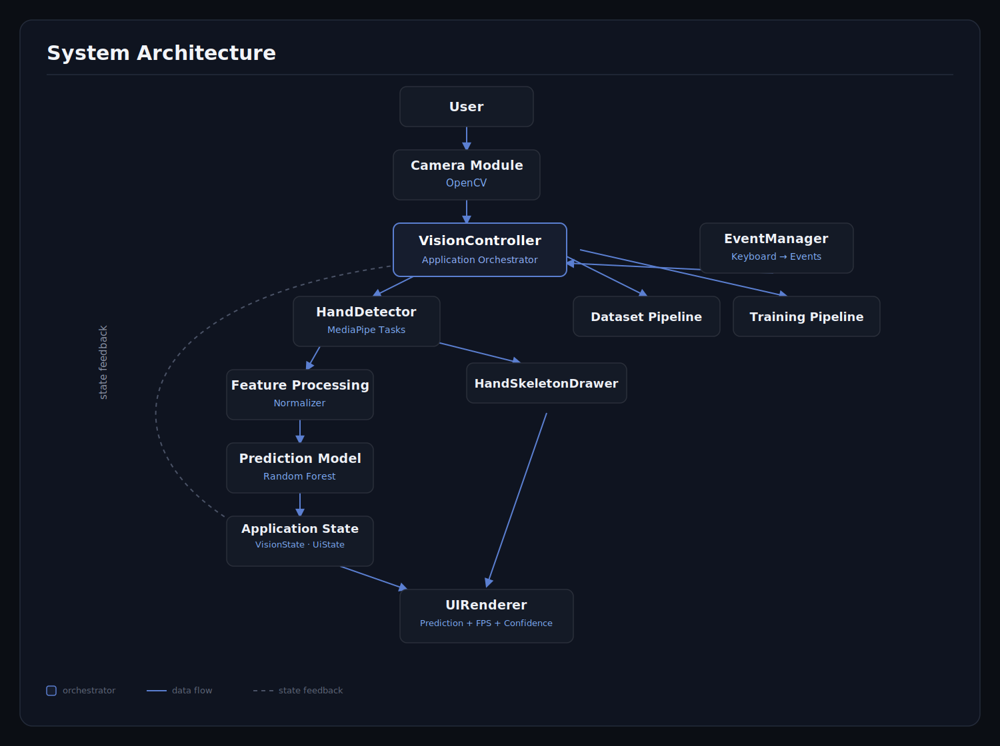
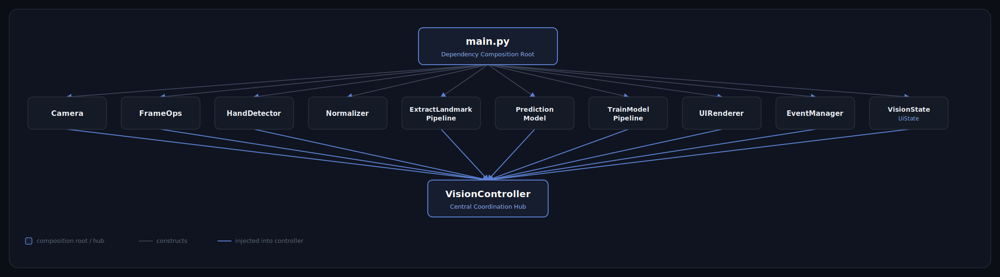
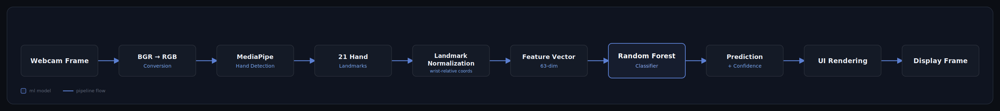
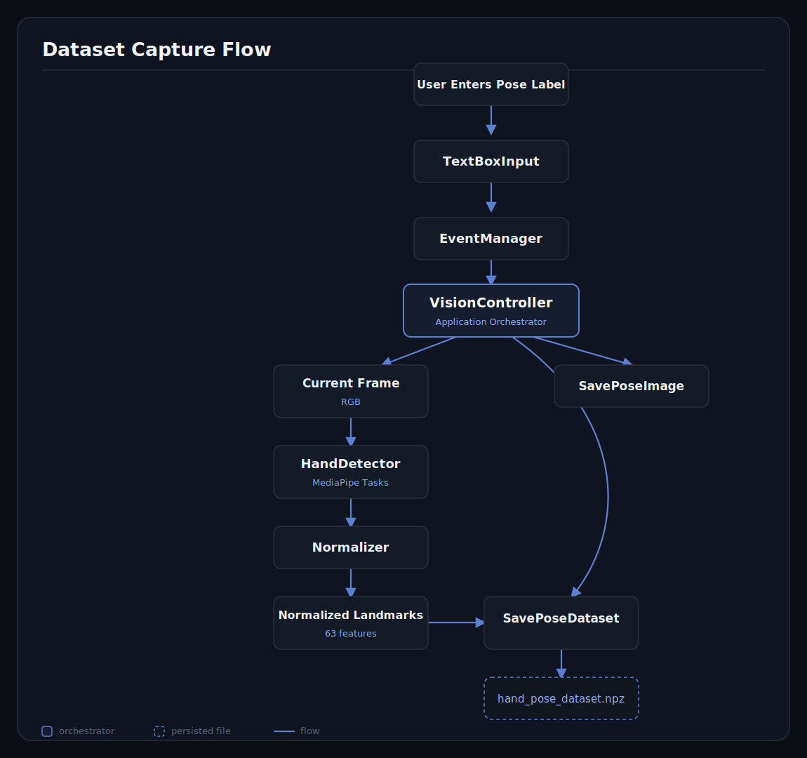
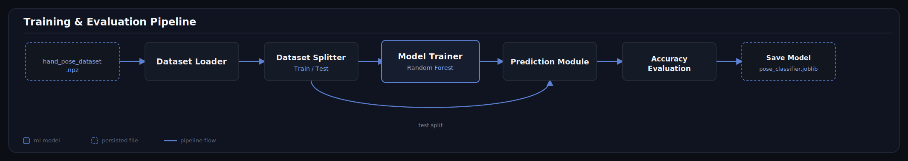
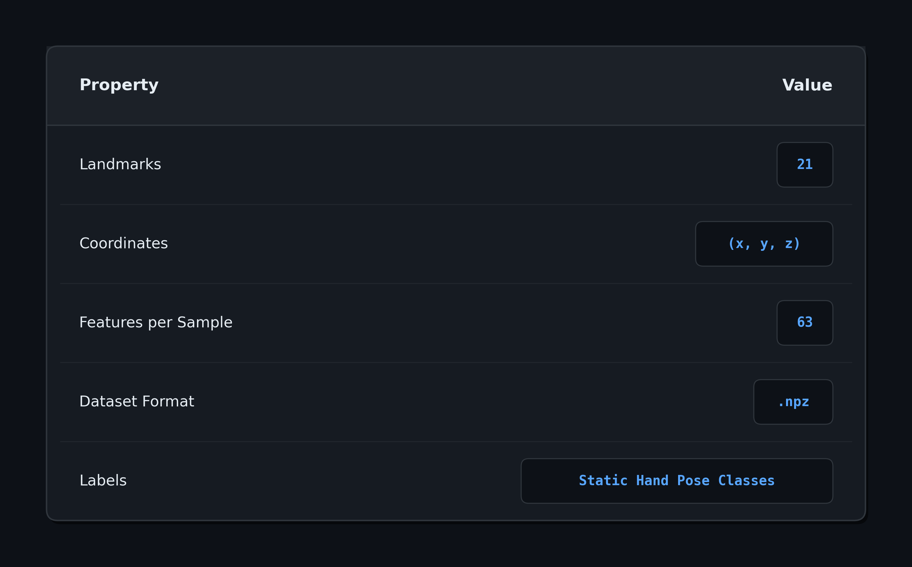
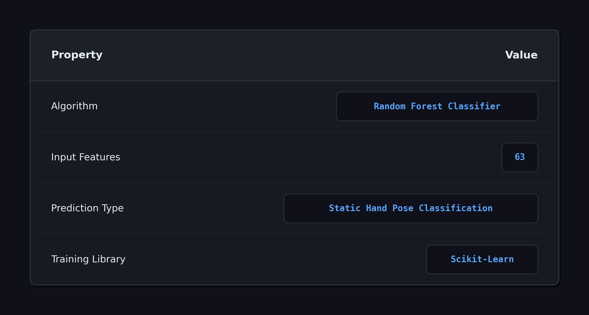

# 🖐 Real-Time Hand Pose Classifier

> A modular machine learning application for real-time static hand pose recognition using **MediaPipe Tasks**, **OpenCV**, and **Scikit-Learn**.

This project demonstrates the complete machine learning engineering workflow—from **dataset collection** and **feature engineering** to **model training**, **real-time inference**, and **graphical visualization**.

Rather than focusing solely on prediction accuracy, the project emphasizes **software architecture**, **maintainability**, **testability**, and **clean modular design** through pipeline-oriented development and the Single Responsibility Principle (SRP).

---

## ✨ Key Highlights

- 🎥 Real-time hand pose recognition using a webcam
- 🖐 MediaPipe Tasks landmark extraction 
- 🤖 Random Forest classifier for fast CPU inference
- 🏗️ Modular pipeline architecture following SRP
- 🧪 Comprehensive unit testing using `pytest`
- 📊 Automated dataset collection and training pipeline
- 🖥️ Custom OpenCV interface with prediction confidence and FPS monitoring

---

# 📖 Overview

Most beginner machine learning projects focus primarily on training a model. This project goes beyond model development by implementing a complete end-to-end computer vision application designed with software engineering principles.

The application captures webcam frames, detects a user's hand using MediaPipe Tasks, extracts and normalizes 21 hand landmarks, generates numerical feature vectors, predicts the corresponding hand pose using a Random Forest classifier, and visualizes the prediction through a custom graphical interface.

To improve maintainability and scalability, the project follows a modular pipeline architecture where every module owns a single responsibility and communicates through clearly defined contracts and interfaces. This allows each component to be developed, tested, and replaced independently.

---

# 🎬 Demo

> **Demo GIF**

<p align="center">
    
</p>

---

# 🚀 Features

## 🖐 Computer Vision

- Real-time webcam capture
- Hand detection using MediaPipe Tasks
- 21-point hand landmark extraction
- Multi-stage landmark validation

---

## 🤖 Machine Learning

- Landmark normalization
- Feature engineering
- Dynamic model loading and injection
- Real-time prediction inference
- Confidence score estimation

---

## 📂 Data Pipeline

- Automatic dataset collection
- Automatic dataset directory and metadata generation
- Dataset management
- Dataset validation
- Model training pipeline
- Persistent model saving and loading

---

## 🖥️ User Interface

- Live prediction overlay
- Confidence visualization
- FPS monitoring
- Detection status indicators
- Transparent UI panels

---

## 🧪 Software Engineering

- Modular architecture
- Single Responsibility Principle (SRP)
- Pipeline-oriented design
- Event-driven and state machine design
- Dependency Injection
- Contract-driven module development
- Comprehensive unit testing with `pytest`

---

# 🏗️ System Architecture

The application is divided into independent layers that separate image acquisition, computer vision, feature engineering, machine learning, and user interface rendering.

Each module communicates through clearly defined interfaces, reducing coupling and making the application easier to maintain, extend, and test.

<p align="center">
    
</p>

---

# 🧩 Software Architecture / Dependency Injection

The application follows a pipeline-oriented architecture where each stage performs exactly one responsibility before passing its output to the next stage.

This design simplifies debugging, improves code readability, and allows individual pipelines to be reused across dataset collection, model training, and real-time inference.

> 📌 Replace this diagram with your finalized pipeline architecture image.

<p align="center">
    
</p>

---

# 🎥 Real-Time Hand Pose Recognition Pipeline

The real-time inference pipeline describes the lifecycle of each camera frame during live hand pose recognition.

A captured frame is processed through multiple stages: image acquisition, hand landmark detection, coordinate normalization, feature extraction, model inference, confidence evaluation, and UI rendering. This pipeline enables continuous real-time prediction while maintaining a clear separation between computer vision processing and application logic.

<p align="center">
    
</p>

---

# 📂 Dataset Collection Pipeline

The dataset collection pipeline automates the process of generating training data for the hand pose classifier.

When a dataset collection event is triggered, the system captures hand images, extracts landmark features, validates the generated data, and stores the processed samples with associated metadata. This workflow ensures consistent dataset organization and reduces manual data preparation.

<p align="center">
    
</p>

---

# 🤖 Model Training Pipeline

The model training pipeline manages the complete machine learning workflow from dataset loading to trained model persistence.

The pipeline performs dataset validation, feature and label separation, train-test splitting, model training, evaluation, and model serialization. This structure allows the training process to be repeatable, testable, and independent from the real-time inference system.

<p align="center">
    
</p>

---

# 📊 Dataset

The classifier operates on **MediaPipe's 21 three-dimensional hand landmarks** instead of raw images.

Each training sample consists of **63 numerical features**, representing the *(x, y, z)* coordinates of every detected landmark.

<p align="center">
    
</p>


### Sample Feature Vector

```text
[
x1, y1, z1,
x2, y2, z2,
...
x21, y21, z21
]
```

### Dataset Structure

```text
X → Landmark Feature Matrix

Y → Pose Labels
```

### Dataset Storage

```text
hand_pose_dataset.npz
```

---

# 🤖 Model

<p align="center">
    
</p>

## Why Random Forest?

Random Forest was selected because the input data consists of structured numerical features rather than raw images.

Compared with deep learning models, it offers an excellent balance between prediction accuracy, inference speed, deployment simplicity, and computational efficiency for real-time CPU applications.

### Advantages

- ⚡ Fast real-time inference
- 💻 No GPU required
- 📈 Handles nonlinear feature relationships
- 🛡️ Robust against overfitting
- 🔧 Minimal preprocessing requirements
- 📦 Easy deployment using Joblib
- 🚀 Excellent performance on tabular landmark data

# 📁 Project Structure

The project is organized into independent modules following a **pipeline-oriented architecture** and the **Single Responsibility Principle (SRP)**. Each module performs one well-defined task and communicates with other modules through explicit contracts and interfaces.

```text
real-time-hand-pose-classifier/
│
├── config.json                # Application configuration files
│
├── data/
│   ├── raw/               # Raw captured pose images
│   ├── hand_pose_dataset.npz           # Generated datasets (.npz)
│
├── docs/                  # README images, diagrams, GIFs
│
├── src/
│   ├── camera/            # Camera abstraction
│   ├── controller/        # Event Manager and Controller
│   ├── data/              # Parse Collected data into NPZ
│   ├── detection/         # MediaPipe hand detector
│   ├── feature/           # Landmark normalization and helper modules
│   ├── inference/         # Model inference
│   ├── model/             # Model training
│   ├── pipeline/          # High-level application pipelines
│   ├── ui/                # OpenCV graphical interface
│   ├── schemas/           # Data contracts
│   └── trained_models/    # Saved machine learning models
│
├── tests/                 # Unit tests
│
├── requirements.txt
├── main.py
├── README.md
```

---

# ⚙️ Installation

## Clone the repository

```bash
git clone https://github.com/yourusername/real-time-hand-pose-classifier.git

cd real-time-hand-pose-classifier
```

## Create a virtual environment (MUST!)

```bash
python -m venv .venv
```

### Windows

```bash
.venv\Scripts\activate
```

### Linux / macOS

```bash
source .venv/bin/activate
```

## Install dependencies

```bash
pip install -r requirements.txt
```

---

# ▶️ Running the Project

The project provides separate pipelines for dataset collection, model training, and real-time prediction.

## 📸 Dataset Collection

Capture labeled hand pose images and automatically generate landmark datasets.

```bash
python src/pipeline/extract_and_save_pose_dataset.py
```

---

## 🤖 Train the Model

Train a Random Forest classifier using the generated dataset.

```bash
python src/model/train_pipeline.py
```

---

## 🖥️ Real-Time Prediction

Launch the webcam and classify hand poses in real time.

```bash
python src/Inference/live_model.py
```

---

# 🧪 Testing

The project uses **pytest** to validate individual modules independently.

Every major component is tested in isolation before integration to ensure predictable system behavior.

## Test Coverage

### Camera

- Camera initialization
- Frame capture
- Frame conversion

### Hand Detection

- Hand detection
- Landmark validation
- Error handling

### Preprocessing

- Landmark normalization
- Feature generation
- Input validation

### Dataset

- Dataset creation
- Dataset loading
- Dataset validation

### Machine Learning

- Model training
- Model loading
- Prediction inference

### Helper Pipelines

- Dataset extraction
- Training pipeline
- Prediction pipeline

---

## Run All Tests

```bash
pytest
```

Output:

```text
==================================================

213 tests passed

==================================================
```

> 📌 Replace this section with a screenshot of your actual test results.

---

# 📈 Results

The Random Forest classifier achieved strong performance while maintaining low inference latency, making it suitable for real-time CPU deployment.

<p align="center">
    
</p>

---

# 🚀 Future Work

This project currently supports **static hand pose classification**. Future improvements will focus on expanding its capabilities toward dynamic gesture recognition and production-ready deployment.

## Machine Learning

- ⏱️ Dynamic gesture recognition using temporal buffers
- 🧠 LSTM-based sequence classification
- 🤖 Transformer-based gesture recognition
- 📊 Benchmark additional machine learning algorithms
- 📈 Hyperparameter optimization

## Computer Vision

- ✋ Multi-hand classification
- 📷 Improved hand tracking stability
- 🎯 Better landmark confidence filtering

## Software Engineering

- 📝 Structured logging system
- ⚡ Performance benchmarking tools
- 📦 Configuration management improvements
- 🧩 Plugin-based pipeline architecture

---

# 📚 Lessons Learned

Building this project provided practical experience in designing a complete machine learning application rather than only training a model.

## 🏗️ Software Engineering

- System architecture design
- Pipeline-oriented application development
- Contract-driven module design
- Single Responsibility Principle (SRP)
- Dependency Injection
- Separation of Concerns
- Test-Driven Development (TDD)
- Unit testing with `pytest`
- Debugging complex software systems
- Memory management and resource cleanup

---

## 🤖 Machine Learning

- Feature engineering
- Landmark normalization
- Dataset generation
- Dataset validation
- Model training
- Model evaluation
- Model deployment
- Real-time inference optimization

---

## 👁️ Computer Vision

- MediaPipe Tasks Vision API
- Hand landmark detection
- OpenCV image processing
- Real-time webcam applications
- Coordinate transformations
- Feature extraction from landmarks

---

## 🛠️ Technologies

<p align="center">
    
</p>

---

# ⭐ Acknowledgements

This project was developed to deepen my understanding of **machine learning engineering**, **computer vision**, and **software architecture** through the implementation of a complete end-to-end application.

It demonstrates not only model development, but also modular software design, testing, maintainability, and real-time deployment principles commonly used in production software systems.